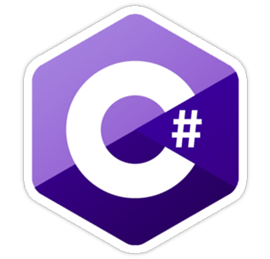
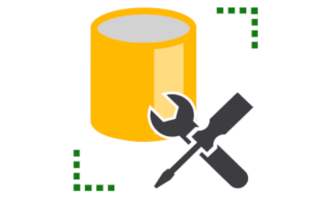

### Hi there, I'm Rune  - aka [RKChrist][website] 👋

## I'm currently a Student, Junior Developer! 🧑‍🎓
- 📖  I'm Currently Learning API & ASP.NET Core (C#)
- 🖥️  I'm interestered in Cyber Security
- 🏁  2021 Goals: Aspire to get better at other languages than C#
- ⚡  Fun Fact: In my free time, I like to broaden my knowledge about programming.

### Socials:
[][website]
[][linkedin]
 

### Languages and Tools:

 
 

---

[website]: RKChrist.dk
[linkedin]: https://www.linkedin.com/in/rune-christensen-737287193/